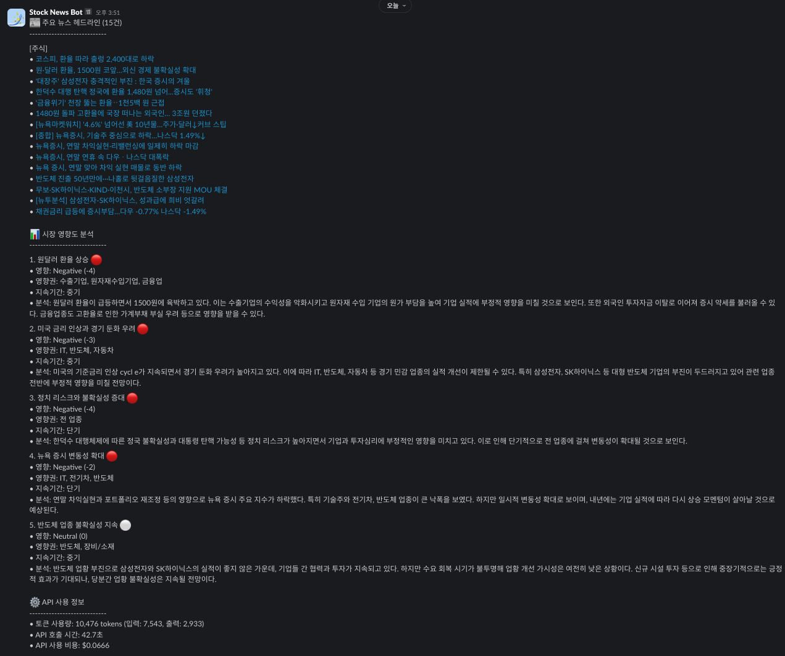

# Stock Analytics Service

실시간 주식 시장 뉴스를 자동으로 수집하고 Claude AI를 활용하여 분석한 후, 중요 뉴스를 선별하여 Slack으로 전송하는 자동화 서비스입니다.



## 핵심 기능

**News 수집기는 다른 레포를 참고**

[뉴스수집기 Repo Link](https://github.com/TeiNam/news_collector)


### 1. 자동 뉴스 수집 및 분석
- 하루 7회 정기 실행 (00:10, 06:10, 09:10, 12:10, 15:10, 18:10, 21:10)
- Claude AI를 활용한 뉴스 중요도 평가
- 유사도 기반 뉴스 클러스터링 (중복 제거)
- 섹션별 뉴스 분류 및 우선순위화

### 2. 뉴스 선별 기준
- 거시경제 뉴스 (금리, 환율, 정책) 우선 선별
- 주요 기업 및 산업 영향 분석
- 시가총액 상위 기업 관련 뉴스
- 미국 증시 및 주요 기술 기업 동향
- 클러스터링을 통한 중요 이슈 식별

### 3. 시장 영향도 분석
- 각 뉴스의 시장 영향력 평가 (-5 ~ +5)
- 영향 받을 섹터 및 종목 분석
- 단기/중기/장기 영향 예측
- Positive/Negative/Neutral 분류

### 4. Slack 알림
- 섹션별 구조화된 뉴스 요약
- 뉴스 원문 링크 제공
- 시장 영향도 분석 결과 포함
- API 사용량 및 비용 정보 제공

## 기술 스택

- **Language:** Python 3.12+
- **AI Engine:** Anthropic's Claude 3 Sonnet
- **Database:** MySQL
- **Dependencies:** 
  - anthropic==0.42.0
  - mysql-connector-python==9.1.0
  - python-dotenv==1.0.1
  - schedule==1.2.2
  - slack_sdk==3.34.0
  - fuzzywuzzy==0.18.0

## 설치 및 설정

### 1. 환경 설정
```bash
# 저장소 클론
git clone [repository_url]
cd stock_analytics

# 가상환경 생성 및 활성화
python -m venv venv
source venv/bin/activate  # Windows: venv\Scripts\activate

# 의존성 설치
pip install -r requirements.txt
```

### 2. 환경변수 설정
`.env` 파일을 생성하고 다음 변수들을 설정:

```env
# Database Configuration
DB_HOST=your_database_host
DB_PORT=3306
DB_USER=your_database_user
DB_PASSWORD=your_database_password
DB_NAME=your_database_name

# Claude AI Configuration
CLAUDE_API_KEY=your_claude_api_key
CLAUDE_MODEL=claude-3-sonnet-20240229
CLAUDE_MAX_TOKENS=4000
MAX_NEWS_ITEMS=10

# Slack Configuration
SLACK_WEBHOOK_URL=your_slack_webhook_url

# Error Handling Configuration
RETRY_MAX_RETRIES=3
RETRY_DELAY=5
```

## 프로젝트 구조 및 모듈 설명

```
stock_analytics/
├── modules/            # 핵심 기능 모듈
│   ├── claude_client.py    # Claude AI 연동 및 분석
│   ├── data_loader.py      # 뉴스 데이터 조회
│   ├── mysql_connector.py  # DB 연결 및 쿼리 실행
│   ├── news_analyzer.py    # 뉴스 분석 로직
│   ├── news_scheduler.py   # 정기 실행 스케줄러
│   └── slack_sender.py     # Slack 메시지 포매팅 및 전송
├── utils/              # 유틸리티 모듈
│   ├── config.py          # 환경변수 및 설정 관리
│   └── logger.py          # 로깅 설정
└── main.py            # 애플리케이션 진입점
```

### 주요 모듈 기능

#### 1. claude_client.py
- Claude AI API 호출 및 응답 처리
- 뉴스 분석 프롬프트 관리
- 토큰 사용량 및 비용 모니터링
- JSON 응답 파싱 및 정제

#### 2. news_analyzer.py
- 뉴스 데이터 전처리
- 유사도 기반 클러스터링
- 분석 결과 구조화

#### 3. data_loader.py
- 시간대별 뉴스 데이터 조회
- 데이터 필터링 및 정제

#### 4. slack_sender.py
- 메시지 템플릿 관리
- 섹션별 뉴스 포매팅
- 대용량 메시지 분할 처리

## 실행 방법

### 일반 실행
```bash
python main.py
```

### 백그라운드 실행 (Linux/Mac)
```bash
nohup python main.py > output.log 2>&1 &
```

## 로깅

- 위치: `logs/news_analyzer_{YYYY-MM-DD}.log`
- 로그 레벨: INFO, WARNING, ERROR
- 로그 로테이션: 10MB 단위, 30일 보관
- 주요 로그 항목:
  - 뉴스 수집 및 분석 현황
  - API 호출 상태 및 비용
  - 에러 및 예외 상황
  - 성능 메트릭스

## 오류 처리

- DB 연결 실패: 최대 3회 재시도
- API 호출 실패: 지수 백오프 적용
- 메시지 크기 제한: 자동 분할 전송
- JSON 파싱 오류: 백업 파서 구현

## 모니터링

### API 사용량
- 입력/출력 토큰 수 추적
- 비용 계산 및 로깅
- 실행 시간 모니터링

### 성능 지표
- 뉴스 처리량
- 분석 소요 시간
- 클러스터링 효율성

## 향후 개선 사항

1. 실시간 모니터링 대시보드 구현
2. 분석 결과의 정확도 평가 시스템
3. 머신러닝 모델을 활용한 1차 필터링
4. API 비용 최적화
5. 분산 처리 시스템 도입

## 라이선스

MIT License
